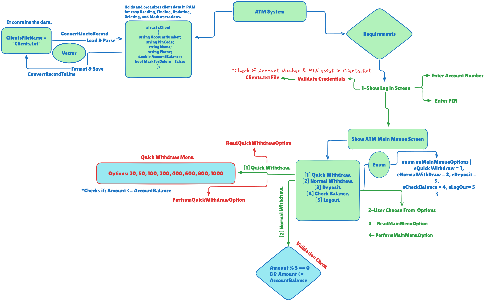

# 🏧 ATM System

A secure, console-based ATM Simulation System built in C++. This project provides clients with an interactive terminal interface to perform automated banking operations securely after undergoing credential authentication against a persistent flat-file database.

---

## 🚀 Features

* **Secure Client Login:** Authenticates access by verifying the account number and PIN code before granting entry to the dashboard.
* **Quick Withdrawal:** Provides immediate preset withdrawal cash options (20, 50, 100, 200, 400, 600, 800, 1000) with dynamic balance checks.
* **Normal Withdrawal:** Allows custom cash withdrawals of any amount, ensuring it is a multiple of 5 and falls within the available account balance.
* **Cash Deposits:** Accepts custom positive deposit amounts and updates the user ledger in real-time.
* **Instant Balance Inquiry:** Instantly displays the client's current total balance securely on screen.

---

## 🛠️ Concepts Used

* **Language:** C++
* **User-Defined Types:** 
  * Enums (`enMainMenueOptions`) for clean, type-safe navigation of the ATM dashboard.
  * Structs (`sClient`) to bundle current client credentials, balances, and global state management.
* **Logic & Control:** Active validation loops (checking for positive deposits and multiples of 5), token-based string parsing, reference passing (`&`) for real-time memory mutations, and terminal clean-ups.
* **Data Persistence (File Handling):** Full live synchronization with a local database file (`Clients.txt`) using file streams (`fstream`) to persistently commit financial transactions across login sessions.

---

## 📐 System Design & Requirements

Below is the architectural layout and requirements logic used to construct the system:

