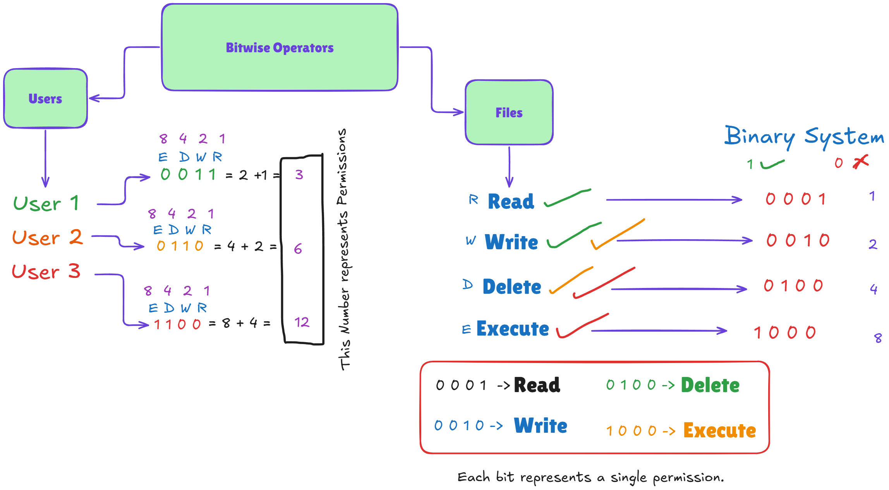
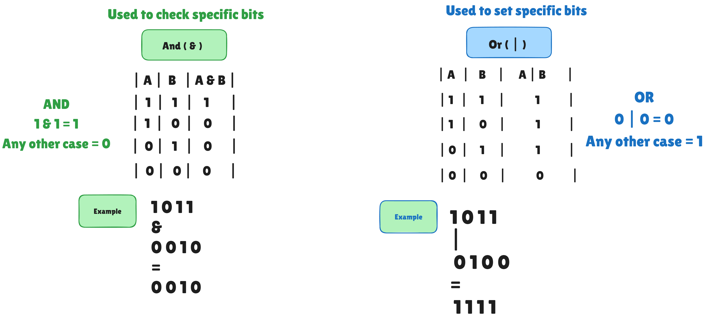
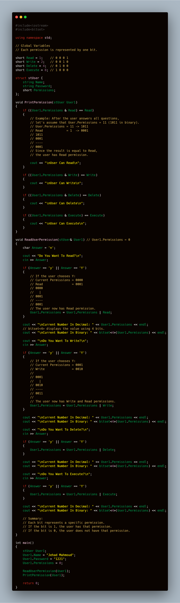

# 🔐 Bitwise Operations & Permissions Management

This section provides a clear explanation and proof-of-concept for managing **User Permissions** using **Bitwise Operators** (`&`, `|`) in C++. 

Instead of storing multiple boolean flags for user access, we represent all permissions within a single integer where each bit corresponds to a specific action.

---

## 💡 System Permissions & Binary Representation

Each permission is assigned a unique bit position (powers of 2):

| Permission | Binary Value | Decimal Value |
| :--- | :---: | :---: |
| **Read** | `0001` | **1** |
| **Write** | `0010` | **2** |
| **Delete** | `0100` | **4** |
| **Execute** | `1000` | **8** |

---

## 🛠️ How Bitwise Operators Work Here

### 1. Setting Permissions using `OR` (`|`)
To add a permission, we perform a bitwise **OR** operation. If any bit is `1`, the resulting bit becomes `1`.

> **Formula:** `UserPermissions = UserPermissions | Permission`

### 2. Checking Permissions using `AND` (`&`)
To verify if a user has a specific permission, we perform a bitwise **AND** operation with a bitmask.

> **Formula:** `(UserPermissions & Permission) == Permission`

---

## 💻 C++ Implementation

Below is the code structure used to demonstrate setting and checking user permissions dynamically:

---

## 🚀 Key Advantages

* **Space Efficient:** Uses a single `short` variable to store up to 16 different permissions.
* **Fast Execution:** Bitwise operations execute directly at the CPU bit-level.
* **Clean Code:** Avoids cluttering structures with multiple boolean variables.

---

## 🔗 Credits & References

* Concept and explanation inspired by the C++ tutorial series on YouTube: [Watch Video Tutorial](https://youtu.be/cR9rikWv0Vk?si=aFtx0pFjGRjPJqQi)